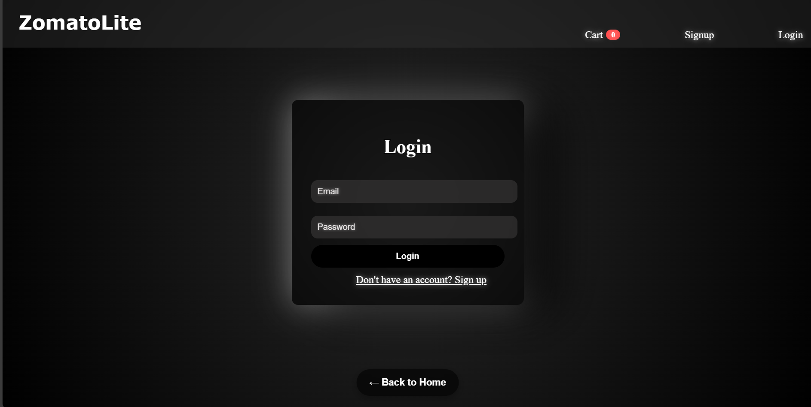

# 🍽️ zomato-clone

This is a full-stack food ordering application inspired by Zomato, built using **React**, **Node.js**, **Express**, and **MongoDB**. The app allows users to browse restaurants, view menus, manage a shopping cart, and place orders.

---

## 🚀 Features

### 👤 User Flow (Simulation)
- Simulated login/signup using `AuthContext` on frontend.
- Conditional route rendering (i.e., cart & order pages are visible only if a user is considered "logged in").

### 🏬 Restaurants & Menu
- Browse restaurants with images, cuisine, and address.
- View menu items of each restaurant.
- Search and filter menu by price.

### 🛒 Cart Management
- Add/remove menu items.
- Live quantity control.
- Total calculation and summary.

### 📦 Order Placement
- Enter delivery location and choose payment method (COD/Online).
- Orders saved in MongoDB database with timestamp.
- Order success message shown on placing an order.

---

## ⚙️ Tech Stack

- **Frontend:** React (with Vite), CSS
- **Backend:** Node.js + Express
- **Database:** MongoDB + Mongoose
- **Routing:** React Router
- **State Management:** React Context API (Cart & Auth)

---

## 📸 Screenshots

### 🔐 Login & Signup
| Login | Signup |
|-------|--------|
|  |  |

### 🏠 Home Page (2 Views)
| Home (Top View) | Home (Scrolled View) |
|------------------|----------------------|
|  |  |

### 🍽️ Menu Page
| Menu |
|------|
|  |

### 🛒 Cart Page (2 Views)
| Cart (Top View) | Cart (Scrolled View) |
|------------------|----------------------|
|  |  |

### ✅ Order Success
| Success |
|---------|
|  |
